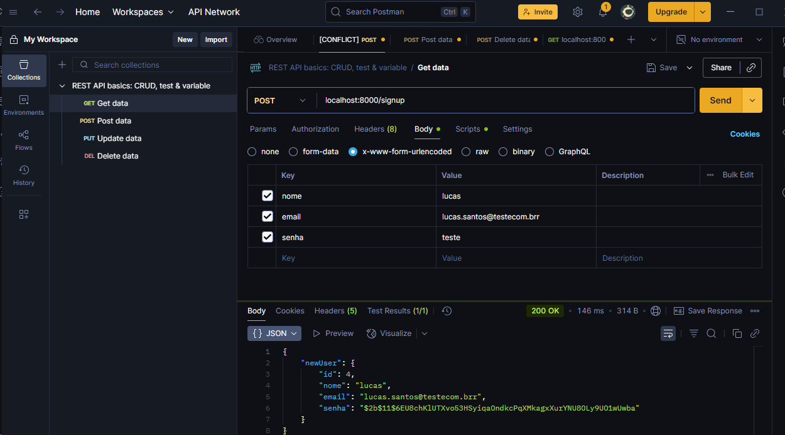

Este projeto foi desenvolvido com o objetivo de aperfeioar minhas habilidades em JS/Node aplicando meus conhecimentos no TypeScript (js com tipagem estatica).

O TypeScript é o Js com o superset, ele adiciona algumas mmelhorias que auxiliam os devs no desenvolvimento mas ainda não é compilado pelo node por padrão.

Além de aprimorar e exercitar os conhecimentos em Ts, utilizei ferramentas como prisma, docker, postgresql, node e fastify.

Também apliquei parte do conhecimento da estrutura SOLID dividindo as responsabilidades das classes pelo código, injeção de dependência, poo e construção de ApiRest.

O desafio consiste em:

Criar endpoints
##POST /signup -> Criar conta##
Fields: name, email and password.

Verificar se o usuário já tem uma conta. Se sim retornar erro 400.
A senha precisa ser armazenada no db com hash.

##POST /session - Fazer login##

Autenticação será feita com email e password.
Verificar se o email já tem uma conta, se não retornar um erro 400.
Validar se a senha informada é valida com o hash salvo no banco
Retornar 400 um erro se a senha estiver errada
Gerar o token para o usuário logado
Quando usuário logar retornar na rota: name, email, token

##POST /tasks → Create new task##
Fields: name, description.

A description da task é opcional.
Uma nova task deve começar no status: "NOT_STARTED"
Ao criar uma nova task a rota deve retornar: task name, description, status, author, author_id

##GET /tasks → List my tasks##

Verificar se o usuário já tem tasks, se não retornar status code 200 informando que o usuário não criou nenhuma task.
Retornar as tasks do usuário

Regra de negócio:

Uma task deve conter identificador único, nome, descrição, status e qual usuário pertence.
Somente o usuário autenticado pode listar as suas atividades
Qualquer usuário pode criar uma conta
As todas: /tasks (get and post), são privadas. Somente o usuário logada pode acessá-las.

############################ Para Rodar o Projeto #####################################

Configure O arquivo Docker compose com a imagen do Postgres e inicie o container com o seguinte comando:

docker-compose up -d

Em seguida instale todos as depenciais com o comando:

npm i

Como prisma ja está inciado, crie o arquivo .env e pegue a estrutura da url de conexão do prisma no site oficial: prisma.io

após isso rode o comando npx prisma db push para adicionar as tabelas ao banco postgres no container on. Esse comando adiciona as tabelas sem deixar historico diferente o prisma migration.

Após isso rode o comando:

npx prisma generate

Responsável por atualizar a biblioteca client.

Por ultimo rode o script de execução ja configurado no package.json:

npm run dev

Comando resposável por executar o código usando ts-node e reiniciar o servidor local sempre que houver mudanças no código.

Utilize postman ou insomnia para testar as rotas

exemplo utilizando Postman:

Se quer o projeto rodando em sua máquina clone o repositório e siga os passos acima:

no seu diretório execute o terminal e digite git clone url-deste-projeto